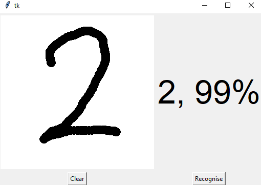

# Handwritten-digit-recognition
Implementation of a handwritten digit recognition app using the MNIST dataset. 
## GUI to predict digits:

 
An interactive window is created where the user can draw the digits on the canvas provided.
 
The function `predict_digit()` takes the image as input and then uses the trained model to predict the digit.
